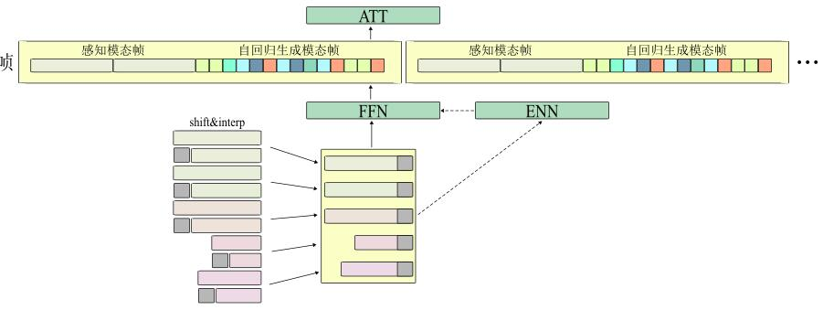
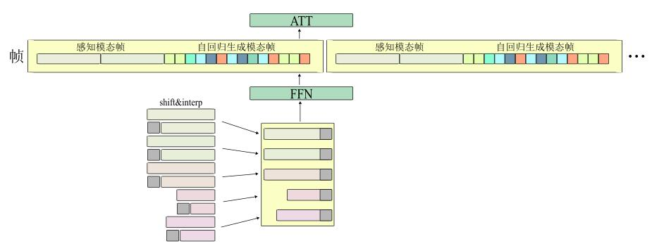
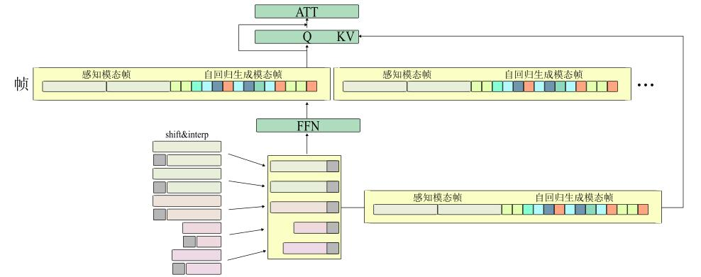

# 多模态模型帧处理管线
## 1. 简介与核心思想

为了解决类transformer结构的base model在同时嵌入不同模态序列时，因不同模态序列在单位时间的序列长度不同，所产生的同步问题，提出`FrameEncode`范式。
`FrameEncode`范式将不同模态分为**帧**，每一帧代表固定长度的单位时间。
- 在每一帧内，单方面输入模型的帧称为**环境帧（感知帧）**，需要模型自回归生成的帧被称为**动态帧（自回归生成帧）**。
- 在模型的`shift`操作时，不同**模态序列**的分别执行`shift`。
- 在模型的`feed forward (ffn)`操作时，所有模态序列并行地经过神经网络。
- 在模型的`self attention (att)`操作时，环境帧内的模态序列被排列在一帧的开头；自回归生成帧内的模态序列被平均混合。并满足以下规则：

    1. 预先规定好每一个模态在当前帧内所有元素的位置。
    2. 对于每一个模态帧中的元素，将它的`attention mask`中与其之前最邻近的每一个**其他模态**元素位置的值置为0。

- 在推理时，首先注入感知帧，然后通过如下顺序推理动态帧：

    1. 在序列开头找到所有**连续的、不同模态的**元素位置，并行推理它们。推理时，将某元素的`attention mask`中在其他元素位置上的值置为0。
    例如，以字母代替模态单元，对于序列`ABCCABCC`首先需要并行推理的元素是`ABC`；而对于序列`AABCAABC`首先需要并行推理的元素只有`A`
    2. 将推理结果加入序列，接下来处理之后的部分。
    3. 循环执行`i.`和`ii.`，直到该帧推理完毕。

- 在预训练时有的任务中没有覆盖规范中的所有模态，怎么办？例如，`视频生成`任务只有`图像序列`与`音频序列`；`视觉问答`任务只有一张`图像`和`文本序列`；`动作生成`任务只有`文本序列`和`动作序列`；`对话`任务中只有`文本序列`（有时可能有`音频序列`）。
    
    - 使用`掩码学习`策略，对没有出现的模态附加mask。在早期训练中，可以直接使用一个`special token`，通过`embedding`来替代未出现的模态，并置对应位置的`loss_mask`为0。在不同模态都经过训练后，可以使用`在线推理`的方式预填充未出现的模态，对应位置的`loss_mask`同样置0，然后训练。
    - 对于`视觉问答`和`对话`等串行任务，可以将整个序列编码成一个仅you2感知模态帧组成的**假帧**，进行训练。
    


#### 几种可能的范式
-   **RWKV deepembed 范式**

-   **RWKV V7 范式**

-   **RWKV Hybrid CrossAttn 范式**



## 2. 核心概念

-   **`ModalityBlock`**: 用来存放一帧内，某一模态序列的块。如果在**假帧**中使用，则无限制。
-   **`ModalityFrame`**: 尚未编码的一帧
-   **`ModalityLatentFrame`**: 编码后的一帧
-   **`ModalityLatentMixingSequence`**: 转换成输入attention形式的一帧（动态帧已被融合，可以直接提取序列）
-   **`List` 容器 (`ListModalityFrame`, `ListModalityLatentFrame`)**: 很多帧，通常认为是一个**训练窗口**的量

## 3. API 手册

---
### 全局参数
```json
"modality_list": [
    ["text","conversation","response","special_token"],
    ["image","heatmap","pc_vision"],
    ["audio"],
    ["touch"],
    ["taste"],
    ["motion"]
],
"modality_mixing_list":[
    "heatmap_condition",
    "image_condition",
    "audio_condition",
    "touch_condition",
    "taste_condition",
    "pc_vision_condition",
    "response_condition",
    "image_dynamic",
    "audio_dynamic",
    "motion_dynamic",
    "text_dynamic",
    "text_condition",
    "think_condition"
]
```
### `ModalityBlock`

#### `__init__(self, modal_type, units, ...)`

-   **描述**: `ModalityBlock` 是最基础的数据单元，代表一段单一模态的连续数据。
-   **参数**:
    -   `modal_type` (str): 来自`modality_list`中，用于标识模态类型
    -   `units` (torch.Tensor): 序列数据
    -   `masks` (Optional[torch.Tensor]): 掩码数据
    -   `attention_masks` (Optional[torch.Tensor]): 注意力掩码
    -   `mixing_mode` (str): 混合模式，`condition`|`dynamic`
    -   `condition_level` (int): 如果`mixing_mode`为`condition`，那么该block中的数据在frame中的次序（相等则随机）。

---

### `ModalityFrame`

`ModalityFrame` 是一个容器，用于管理一组 `ModalityBlock`，代表一帧内的多模态数据。

#### `embed(self, embedding_dict)`

-   **描述**: 将帧内数据根据模态分流到编码器字典embedding_dict中并行执行嵌入操作。
-   **返回**: `ModalityLatentFrame`

#### `apply_by_modal(self, module_dict)`

-   **描述**: 将帧内数据根据模态分流到torch模块中并行处理
-   **返回**: `ModalityFrame`

#### `apply_module_parallel(self, module)`

-   **描述**: 将帧内数据送入torch模块中并行处理
-   **返回**: `ModalityFrame`

#### `calc_loss(self, modality_loss_func_dict, origin_frame)`

-   **描述**: 将帧内数据根据模态分流到不同loss模块中计算损失。
-   **参数**: 
    - `origin_frame` `ModalityFrame` 用来计算loss的标签数据
-   **返回**: `Dict[str, torch.Tensor]` 模态损失字典

---

### `ModalityLatentFrame`

`ModalityLatentFrame` 是 `ModalityFrame` 的潜空间版本，其 `units` 已经是嵌入后的特征向量。

#### `add_condition_special_tokens(self, embedding)`

-   **描述**: 为环境帧包裹`special tokens`
-   **参数**: 
    - `embedding` 文本用的embedding
-   **返回**: `self`

#### `arrange_frame(self)`

-   **描述**: 排列该帧的数据成为一个序列，用于输入att层
-   **参数**: 无
-   **返回**: `ModalityLatentMixingSequence`

#### `shift(self, shift_states_dict)`

-   **描述**: 执行`shift`操作，返回`x_prev - x`
-   **参数**: 每个模态的`shift_states`
-   **返回**: `ModalityLatentFrame`


#### `__add__(self, other)`

-   **描述**: 与另外一个`ModalityLatentFrame` 实例数值相加
-   **参数**: `other` `ModalityLatentFrame` 另一个实例
-   **返回**: `ModalityLatentFrame`

---

### `ModalityLatentMixingSequence`

由 `ModalityLatentFrame.arrange_frame` 生成的、用于送入Attention的扁平化序列。

#### `rearrange_frame(self)`

-   **描述**: 将该实例的形状还原回ModalityLatentFrame
-   **参数**: 无
-   **返回**: `ModalityLatentFrame`

---

### `ListModalityFrame` & `ListModalityLatentFrame`

这两个类是 `ModalityFrame` 和 `ModalityLatentFrame` 的列表容器，提供了跨多个 `Frame` 的全局并行处理能力。

#### `embed(self, embedding_dict)` (ListModalityFrame)

-   **描述**: 与`ModalityFrame`中对应函数的功能一致
-   **返回**: `ListModalityLatentFrame`

#### `arrange_frame(self)` (ListModalityLatentFrame)

-   **描述**: 与`ModalityLatentFrame`中对应函数的功能一致
-   **返回**: `ListModalityLatentMixingSequence`

#### `shift(self, shift_states_dict)` (ListModalityLatentFrame)

-   **描述**: 与`ModalityLatentFrame`中对应函数的功能一致
-   **返回**: `ListModalityLatentFrame`

#### `calc_loss(self, ..., origin_frame)` (ListModalityLatentFrame)

-   **描述**: 与`ModalityLatentFrame`中对应函数的功能一致
-   **返回**: `Dict[str, torch.Tensor]`

#### 其他并行方法

-   `apply_by_modal`, `apply_by_modal_and_mixing_mode`, `apply_module_parallel`
    -   **描述**: 与`ModalityFrame`、`ModalityLatentFrame`中对应函数的功能一致

---

### `ListModalityLatentMixingSequence`

由 `ListModalityLatentFrame.arrange_frame` 生成的混合序列。

#### `rearrange_frame(self)`

-   **描述**: 将该实例的形状还原回ListModalityLatentFrame
-   **参数**: 无
-   **返回**: `ListModalityLatentFrame`

---

### 辅助函数

#### `get_shift_states(frame_or_list)`

-   **描述**: 获取frame中每个模态的shift_states
-   **返回**: states_dict

